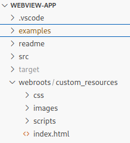

# webview-app
Rust Web View Application for Windows and Linux similar to Electron, but very light weight. It offers the possibility to make web requests from the web site to the rust app and to send events from rust to the web site. The web site can be hosted as integrated resource, of course alternatively via HTTP(s):// or file://.

Sample webview_app:


# Table of contents
1. [Introduction](#features)
2. [Setup](#setup)
    1. [Additional step for Windows](#prewindows)
3. [Hello World (a minimal web view app)](#helloworld)    
4. [WebViewBuilder's featues](#webViewfeatures)
    1. [Creating WebViewBuilder and running app](#featuresCreating)
    2. [Url](#featuresUrl)
    3. [Custom resource scheme](#featuresCustomScheme)
    4. [Debug Url](#featuresDebugUrl)
    5. [Title](#featuresTitle)
    6. [Initial Bounds](#featuresInitialBounds)
    7. [Save Bounds](#featuresSaveBounds)    
    8. [Developer Tools](#featuresDevTools)
    9. [Disable WebView's default Context Menu](#featuresDefaultContextMenuDisabled)
    10. [Add a query string to the Url](#featuresQueryString)
5. [Callback when closing the Web View](#canclose)
6. [Requests from Web View's javascript to the rust app](#requests)
    1. [Non UI blocking request processing](#blockingrequests)
7. [Calls to Web View's javascript (Events)](#events)    
8. [Other injected Javascript functions](#injected)    
9. [Window Customizations](#customizations)
    1. [Disable the native titlebar on Windows](#disabletitlebar)
    2. [Enhance the Gtk4 Window on Linux](#withbuilder)

## Features <a name="features"></a>

webview_app includes following features:
* Functional approach with a builder pattern
* The same setup (almost) for Windows and Linux version 
* Uses WebView2 on Windows and WebKitGtk-6.0 on Linux
* Can serve the web site via resources (single file approach)
* Optional save and restore of window bounds
* Has an integrated event sink mechanismn, so you can retrieve javascript events from the Rust app
* Offers the possibility to serve requests from javascript to Rust
* You can expand the Gtk4 Window (on Linux) with a custom header bar
* You can alternatively disable the Windows titlebar and borders, and you can build a title bar in HTML with standard Windows logic for closing, maximizing, restoring resizing, snap to dock, ...

Functional approach with webview builder:

```rs
fn on_activate(app: &Application)->WebView {
    let webview = WebView::builder(app)
        .title("Website form custom resources 🦞")
        .save_bounds()
        .devtools(true)
        .webroot(include_dir!("webroots/custom_resources"))
        .query_string("?param1=123&param2=456")
        .default_contextmenu_disabled()
        .build();

     webview
}

fn main() {
    Application::new("de.uriegel.hello")
    .on_activate(on_activate)
    .run();
}
```
Sample of a Windows App with custom titlebar:
 

## Setup <a name="setup"></a>

In order to create a WebView app, you have to  create a rust console app with ```cargo new``` or ```cargo init```.

Then add the webview_app crate with ```cargo add webview_app```.


### Additional step for Windows <a name="prewindows"></a>
To get rid of the console window, you can hide it.

Add the following code to your main.rs file at the top:

```rs
#![cfg_attr(not(debug_assertions), windows_subsystem = "windows")]
// Allows console to show up in debug build but not release build.
```

Now there is no console window in release mode but not debug mode to be able to see console logs.

## Hello World (a minimal web view app) <a name="helloworld"></a>

This is a minimal approach in main.rs for creating a WebView app:

```rs
#![cfg_attr(not(debug_assertions), windows_subsystem = "windows")]
// Allows console to show up in debug build but not release build.

use webview_app::{application::Application, webview::WebView};

fn on_activate(app: &Application)->WebView {
    WebView::builder(app)
        .title("Rust Web View 🦞")
        .url("https://crates.io/crates")
        .build()
}

fn main() {
    Application::new("de.uriegel.hello")
    .on_activate(on_activate)
    .run();
}
```


Congratulations! Your first web view app is running!

## WebViewBuilder's featues <a name="webViewfeatures"></a>

### Creating WebViewBuilder and running app <a name="featuresCreating"></a>

The absolute minimal program is

```rs
use webview_app::{application::Application, webview::WebView};

fn on_activate(app: &Application)->WebView {
    WebView::builder(app)
        .build()
}

fn main() {
    Application::new("de.uriegel.hello")
    .on_activate(on_activate)
    .run();
}
```

```Application::new()``` creates a new Application. Parameter is ```appid```. This is used for creating a directory path for temporary data and saving window bounds in a file. Also for Linux it is the GTK App ID. When the app is being created, the callback function ```on_activate``` is being called in order to create the WebView window.

In this callback a WebViewBuilder is being created with the constructor
``` WebView::builder()```. This builder has a lot of optional builder functions to add behaviors to the web app. To create the WebView, you have to call WebView::build().

At the end you have to call the function ```Application::run```. This function calls ``` on_activate```  and creates the web view app, runs the application and show the Web View. 

Of course in this minimal setup only an empty window appears. You have to call one or more of the following builder functions. They have all in common that they are optional and are returning the web view builder, so that the builder functions can be chained and one big declaration is created.

When you close the window, the app is stopping.

### Url <a name="featuresUrl"></a>

In the minimal sample above a web view was created, but it was empty. So the most important builder function is ```url``` to set an url like this:

```rs
fn on_activate(app: &Application)->WebView {
    WebView::builder(app)
        .url("https://crates.io/crates")
        .build()
}
```
Now the web app is doing something, it is displaying crates's home page! 

### Custom resource scheme <a name="featuresCustomScheme"></a>

The complete web site can be included as resource in the executable (for single file approach). 

In order to do this, you have to add the crate ```include_dir```. The web site has to be in the directory of the web app:



Now you have to call the method ```WebViewBuilder::webroot``` and add the relative path to the web site, in this case ```webroots/custom_resources```:

```rs
    WebView::builder(app)
        .title("Website form custom resources 🦞")
        .webroot(include_dir!("webroots/custom_resources"))
        .build()

```

Do not call the method ```url```!

### Debug Url <a name="featuresDebugUrl"></a>

Sometimes you have to use a different url for debugging the app, for example when you use a react app. If you want to debug this web app, you have to use vite's debug server ```http://localhost:5173```. But when you build the final web app, you want to include the built web app as resource.

For debugging the web app you can use the builder function ```debug_url``` together with ```url``` (or with ```webroot```). 

```rs
use include_dir::include_dir;

fn on_activate(app: &Application)->WebView {
    WebView::builder(app)
        .debug_url("https://crates.io/crates/webview_app")
        .url("https://crates.io/crates")
        .build()
}

```

### Title <a name="featuresTitle"></a>

The created app has a default title. Take the builder function ```title``` to set one.

```rs
    ...
    WebView::builder(app)
        .title("My phenominal web app")
    ...
```
### Initial Bounds <a name="featuresInitialBounds"></a>

With the help of the method ```initial_bounds``` you can initialize the size of the window with custom values.

```rs
...
    WebView::builder(app)
        .initial_bounds(1200, 800)
...
```
In combination with ```save_bounds``` this is the initial width and heigth of the window at first start, otherwise the window is always starting with these values.

### Save Bounds <a name="featuresSaveBounds"></a>

When you call ```save_bounds```, then windows location and width and height and normal/maximized state is saved on close. After restarting the app the webview is displayed at these settings again.

```rs
...
    WebView::builder(app)
        .save_bounds()
...
```
The parameter ```appid``` in the constructor ```Application::new```  is used to create a path, where these settings are saved.

### Developer Tools <a name="featuresDevTools"></a>

Used to enable (not to show) the developer tools. Otherwise it is not possible to open these tools.
The developer tools can be shown by default context menu or by calling the javascript method ```WebView.showDevtools()```

```rs
...
    WebView::builder(app)
        .devtools(true)
...
```
When you set the parameter ```only_when_debugging``` to ```true```, then the developer tools are not shown when the app is build in release mode.

### Disable WebView's default Context Menu <a name="featuresDefaultContextMenuDisabled"></a>

If you call ```default_contextmenu_disabled```, the web view's default context menu is not being displayed when you right click the mouse.

```rs
...
    WebView::builder(app)
        .default_contextmenu_disabled()
...

```

### Add a query string to the Url <a name="featuresQueryString"></a>

You can set a query string to the url by calling the method ```query_string```. The query string is added to the ```debug_url```, the ```url``` or when using the custom resource scheme.

```rs
...
    WebView::builder(app)
        .debug_url("http://localhost:5173/")
        .webroot(include_dir!("webroot"))
        .query_string("?param1=123&param2=456")
...

```


## Callback when closing the Web View <a name="canclose"></a>

When the Web View and therefore the application is to be closed, you can be informed and prevent this by installing a callback with the help of ```can_close```.

```rs
...
    fn can_close()->bool {
        true
    } 

    let webview = WebView::builder(app)
        .webroot(include_dir!("webroot"))
    webview.can_close(|| can_close());
    webview        
...

```

## Requests from Web View's javascript to the rust app <a name="requests"></a>

```webview_app``` offers the possibility to call requests from the Web View via javascript to the rust app.
You have to install a callback which is called when a special injected javascript function is called.

To install this callback, use the function ```connect_request```:
```rs
...
    fn handle_request1(json: String)->String {
        let input: Input = request::get_input(&json);
        ...
        request::get_output(result);
    }

    let webview = WebView::builder(app)
        .webroot(include_dir!("webroot"))
    webview.connect_request(move|request, id, cmd, json| {
        match cmd.as_str() {
            "cmd1" => handle_request1(json),
            ...
        }
        true
    });
    webview        
...

```
You get a json string as input parameter which you can deserialize with the help of ```request::get_input(json)```. 
Every request gets a unique id and can have a command name (```cmd```). The result should be a json formatted string. 
You can create this string with ```request::get_output(result)```. Result is a struct with the Trait ```Deserialize``` set.

To create this request from javascript, use the following injected function:

```js
const res = await WebView.request("cmd1", {
    text: "Text",
    number: 123
})
``` 

## Non UI blocking request processing <a name="blockingrequests"></a>

The processing of the request is blocking the UI. To prevent this, there is a runtime which transfers the processing in another thread.
You can call the runtime processing with ```request_blocking```:

```rs
fn cmd1(request: &Request, id: String, json: String) {
    request_blocking(request, id, move || {
        let input: Input = request::get_input(&json);
        let res = Output {
            email: "uriegel@hotmail.de".to_string(),
            text: input.text,
            number: input.id + 1,
        };

        thread::sleep(Duration::from_secs(5));

        request::get_output(&res)
    })
}
``` 

For the Linux version exists another runtime: ```request_async```. With this approach you can call async GTK functions:

```rs
fn cmd2(request: &Request, id: String) {
    request_async(request, id, async move {
        let res = Output {
            email: "uriegel@hotmail.de".to_string(),
            text: "Return fom cmd2".to_string(),
            number: 456,
        };

        glib::timeout_future_seconds(5)
            .await;

        request::get_output(&res)
    })
}
``` 
The processing is async but runs in the UI thread, so you must not call blocking functions!

## Calls to Web View's javascript (Events) <a name="events"></a>

The other direction is also possible: Calling javascript code from rust. With the function ```WebView::eval``` you can call javascript code. You need a handle to the webview which you get by calling the method ```get_handle```  from the webview built by WebViewBuilder:

```rs
let webview = WebView::builder(app)
    ...
    .build();
let handle = webview.get_handle();

webview.connect_request(move|request, id, cmd: String, json| {
        let handle = handle.clone();
        match cmd.as_str() {
            "cmd1" => { thread::spawn(move||{
                    let mut index = 0;
                    loop {
                        thread::sleep(Duration::from_secs(5));
                        index+=1;
                        WebView::eval(handle.clone(), &format!("onEvent({index})"));
                    };
                });
            },
            _ => {}
        }
        true
    });
    webview

```

## Other injected Javascript functions <a name="injected"></a>

There are two functions you can call in javascript on the injected WebView object:

* ```WebView.closeWindow()```
* ```WebView.showDevTools()```

With  ```closeWindow``` you can close the app from javascript code.

With  ```showDevTools()``` you can show the Developer Tools from javascript code, but only when ```devtools()``` on the ```WebViewBuilder``` was called.

## Window Customizations <a name="customizations"></a>

### Disable the native titlebar on Windows <a name="disabletitlebar"></a>

You can hide the native titlebar on Windows, so that the complete WebView app is HTML. You don't have to miss Aero Grip or Window shadow.

First you have to get rid of the native Windows titlebar:

```rs
    WebView::builder(app)
        .title("Website form custom resources 🦞")
        .webroot(include_dir!("webroots/custom_resources"))
        .without_native_titlebar()
        .build()
```
To create a titlebar in HTML, you have to create one like this:

```HTML
<div className="titlebar">
    
    <div class="titlebarGrip">
        <span id="$TITLE$"></span>
    </div>
    <div class="titlebarButton" id="$MINIMIZE$"><span className="dash">&#x2012;</span></div>
    <div class="titlebarButton" id="$RESTORE$"><span>&#10697;</span></div>  
    <div class="titlebarButton" id="$MAXIMIZE$"><span>&#9744;</span></div>
    <div class="titlebarButton close" id="$CLOSE$"><span>&#10005;</span></div>
</div>
```

To get titlebar control like moving the Window or snap to maximize, you have to declare a draggable region. In this case it is the ```<div>``` with the class "titlebarGrip".
In css it is declared as: 

```css
.titlebarGrip {
    flex-grow: 1;
    text-align: center;
    vertical-align: middle;
    margin: 3px 3px 0px 0px;    
    -webkit-app-region: drag;
    display: flex;
    align-items: center;  
}
```

```-webkit-app-region: drag;``` does the magic!

To get the Window buttons functioning, you have to declare ```<div>``` objects with special ids:
* ```$MINIMIZE$``` to minimize the Window
* ```$RESTORE$``` to restore the Window
* ```$MAXIMIZE$``` to maximize the Window
* ```$CLOSE$``` to close the Window

You can achieve this funcionality when you call

``` WebView.initializeNoTitlebar()``` 

in Javascript. A HTML element with the id ```$TITLE$``` becomes the title of the Window, the title string set in the rust WebViewBuilder is then set as Window Title.

Sample of a Windows App with custom titlebar:
 

### Enhance the Gtk4 Window on Linux <a name="withbuilder"></a>

If you want to extend the Web View window in Linux, you can call the WebViewBuilder function with_builder, which is only present in the Linux version.
With this method you are responsible to create a Gtk4 window which hosts the WebView. This function you have to call with a str parameter, the path to the UI resource for the window.

The UI resource has to be included in the executable, please consult the rust GTK4 book.

For further information please look at the linux_titlebar example in GitHub project of webview_app.
