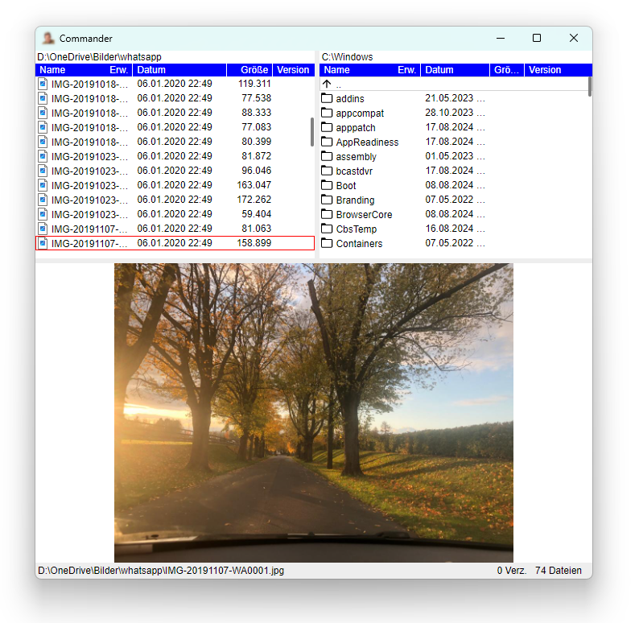
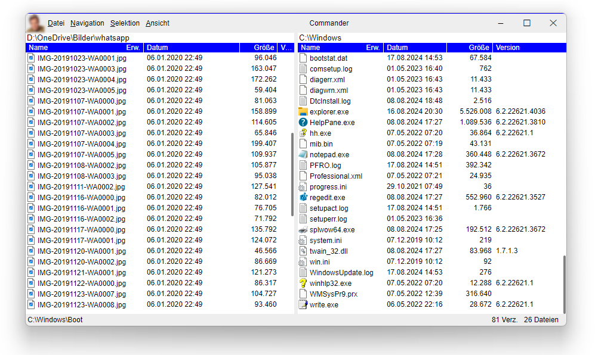
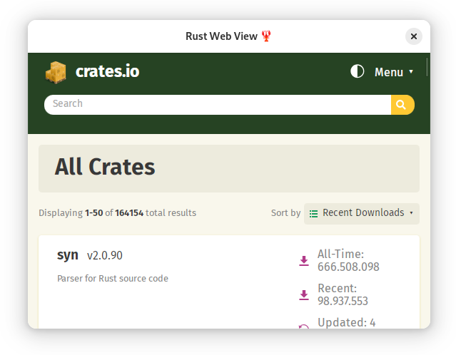

# webview-app
Rust Web View Application for Windows and Linux similar to Electron, but very light weight. It offers the possibility to make web requests from the web site to the rust app and to send events from rust to the web site. The web site can be hosted as integrated resource, of course alternatively via HTTP(s):// or file://.

Sample webview_app:


# Table of contents
1. [Introduction](#features)
2. [Setup](#setup)
    1. [Additional step for Windows](#prewindows)
3. [Hello World (a minimal web view app)](#helloworld)    
4. [WebViewBuilder's featues](#webViewfeatures)
    1. [Creating WebViewBuilder and running app](#featuresCreating)
    2. [Url](#featuresUrl)
    3. [Custom resource scheme](#featuresCustomScheme)

## Features <a name="features"></a>

webview_app includes following features:
* Functional approach with a builder pattern
* The same setup (almost) for Windows and Linux version 
* Uses WebView2 on Windows and WebKitGtk-6.0 on Linux
* Can serve the web site via resources (single file approach)
* Optional save and restore of window bounds
* Has an integrated event sink mechanismn, so you can retrieve javascript events from the Rust app
* Offers the possibility to serve requests from javascript to Rust
* You can expand the Gtk4 Window (on Linux) with a custom header bar
* You can alternatively disable the Windows titlebar and borders, and you can build a title bar in HTML with standard Windows logic for closing, maximizing, restoring resizing, snap to dock, ...

Functional approach with webview builder:

```rs
fn on_activate(app: &Application)->WebView {
    let webview = WebView::builder(app)
        .title("Website form custom resources 🦞")
        .save_bounds()
        .devtools(true)
        .webroot(include_dir!("webroots/custom_resources"))
        .query_string("?param1=123&param2=456")
        .default_contextmenu_disabled()
        .build();

     webview
}

fn main() {
    Application::new("de.uriegel.hello")
    .on_activate(on_activate)
    .run();
}
```
Sample of a Windows App with custom titlebar:
 

## Setup <a name="setup"></a>

In order to create a WebView app, you have to  create a rust console app with ```cargo new``` or ```cargo init```.

Then add the webview_app crate with ```cargo add webview_app```.


### Additional step for Windows <a name="prewindows"></a>
To get rid of the console window, you can hide it.

Add the following code to your main.rs file at the top:

```rs
#![cfg_attr(not(debug_assertions), windows_subsystem = "windows")]
// Allows console to show up in debug build but not release build.
```

Now there is no console window in release mode but not debug mode to be able to see console logs.

## Hello World (a minimal web view app) <a name="helloworld"></a>

This is a minimal approach in main.rs for creating a WebView app:

```rs
#![cfg_attr(not(debug_assertions), windows_subsystem = "windows")]
// Allows console to show up in debug build but not release build.

use webview_app::{application::Application, webview::WebView};

fn on_activate(app: &Application)->WebView {
    WebView::builder(app)
        .title("Rust Web View 🦞")
        .url("https://crates.io/crates")
        .build()
}

fn main() {
    Application::new("de.uriegel.hello")
    .on_activate(on_activate)
    .run();
}
```



Congratulations! Your first web view app is running!

## WebViewBuilder's featues <a name="webViewfeatures"></a>

### Creating WebViewBuilder and running app <a name="featuresCreating"></a>

The absolute minimal program is

```rs
use webview_app::{application::Application, webview::WebView};

fn on_activate(app: &Application)->WebView {
    WebView::builder(app)
        .build()
}

fn main() {
    Application::new("de.uriegel.hello")
    .on_activate(on_activate)
    .run();
}
```

```Application::new()``` creates a new Application. Parameter is ```appid```. This is used for creating a directory path for temporary data and saving window bounds in a file. Also for Linux it is the GTK App ID. When the app is being created, the callback function ```on_activate``` is being called in order to create the WebView window.

In this callback a WebViewBuilder is being created with the constructor
``` WebView::builder()```. This builder has a lot of optional builder functions to add behaviors to the web app. To create the WebView, you have to call WebView::build().

At the end you have to call the function ```Application::run```. This function calls ``` on_activate```  and creates the web view app, runs the application and show the Web View. 

Of course in this minimal setup only an empty window appears. You have to call one or more of the following builder functions. They have all in common that they are optional and are returning the web view builder, so that the builder functions can be chained and one big declaration is created.

When you close the window, the app is stopping.

### Url <a name="featuresUrl"></a>

In the minimal sample above a web view was created, but it was empty. So the most important builder function is ```url``` to set an url like this:

```rs
fn on_activate(app: &Application)->WebView {
    WebView::builder(app)
        .url("https://crates.io/crates")
        .build()
}
```
Now the web app is doing something, it is displaying crates's home page! 

### Custom resource scheme <a name="featuresCustomScheme"></a>

The complete web site can be included as rust resource in the executable. 


With the ```res://``` url specifier it is possible that the web view is automatically loaded from resources. All you have to do is include the website parts as .NET resources and add logical names with the help of the ```LogicalName``` node. The resources have to be included in the .csproj file like this: